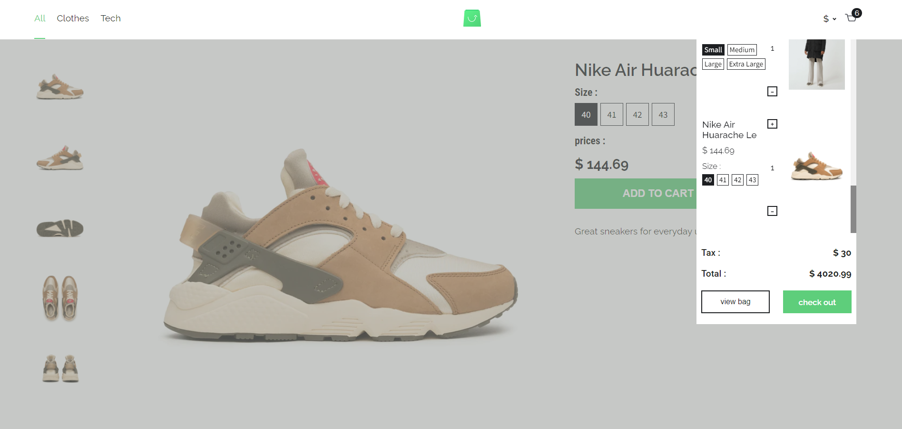

# Scandiweb React Project
- This is a minimalist storefront react project built for scandiweb screening test. in this project, the endpoint was fetched using apollo-graphql

## Project Preview

 cart                                    |  category page
:---------------------------------------:|:---------------------------------------:
                   |   


### Built With

- [React](https://es.reactjs.org/)
- [HTML](https://www.w3schools.com/html/)
- [CSS](https://www.w3schools.com/css/)
- [JS](https://www.javascript.com/)


This project was bootstrapped with [Create React App](https://github.com/facebook/create-react-app).

### Installation

1. Clone the repository
   ```sh
   git clone https://github.com/xtrahuman/Okpara-Tochukwu-react.git
   ```
2. Install NPM packages
   ```sh
   npm install
   ```
3. Run server
   ```sh
   npm start
   ```
## Authors

👤 **Okpara Tochukwu**

- GitHub: [@xtrahuman](https://github.com/xtrahuman)
- LinkedIn: [LinkedIn](https://linkedin.com/in/tochukwuokpara)

## 🤝 Contributing

Contributions, issues, and feature requests are welcome!

Feel free to check the [issues page](../../issues/).

## Acknowledgments

Original design idea by Scandiweb.

## Show your support

Give a ⭐️ if you like this project!
